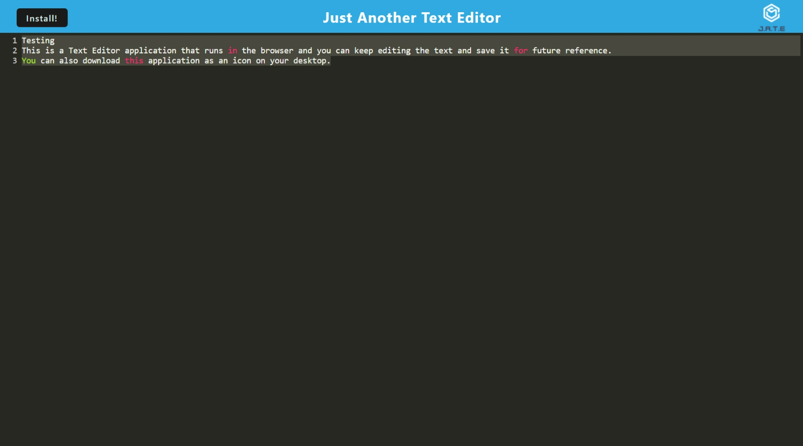

  
  # Text Editor (Progressive Web Application)

  ## Description

  This is a Text Editor application that runs in the browser and you can keep editing the text and save it for future reference. You can also download this application as an icon on your desktop. The application will also function offline.

  ## Table of Contents

  * [Installation](#installation)
  * [Usage](#usage)
  * [Project URL](#project-url)
  * [Project Image](#project-image)
  * [Credits](#credits)
  * [License](#license)
  * [Questions](#questions)
  
  ## Installation

  To run this application on your local machine, follow these steps:

    1. Download the code in your local machine and run `npm install` in the terminal to install all the dependencies.
    2. Start the server by running `npm run start:dev` in command prompt.
    3. Run the application in the browser by making a request to http://localhost:3000/.  

  ## Usage

  When you open the application in the browser, you can view the default text. You can start adding text and it will save the data as is. When you revisit you can see the text you added before. You can also download it on to your desktop by clicking install button. This is a single-page progressive web application. Tt features a number of data persistence techniques (IndexDB and Local Storage) that serve as redundancy in case one of the options is not supported by the browser.
  

  ## Project URL

  URL link to the tech-editor webpage:
  (https://saritha-text-editor-a3177a19c39d.herokuapp.com/).

  ## Project Image
  
  The following image show the web application's appearance and functionality:

  

  ## Credits

  Built this application based on the knowledge gained from bootcamp activities.

  ## License

  This project is licensed under the MIT license.

  ## Questions

   Check out the code and my other projects at [saritha2708](https://github.com/saritha2708).
   
   If you have any questions reach out to me at [saritha.2708@gmail.com](mailto:saritha.2708@gmail.com).

  